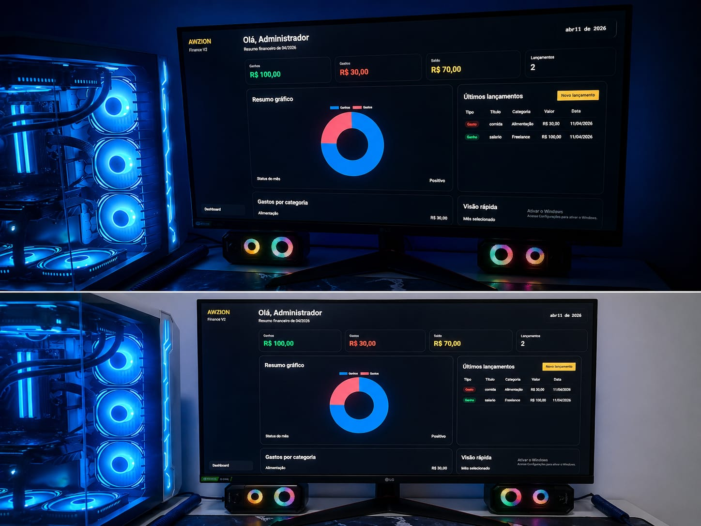
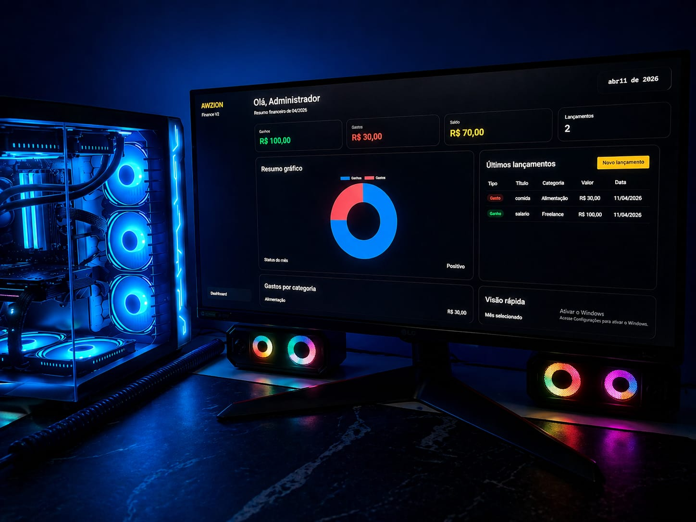

# 🚀 AWZION Finance v2

Sistema financeiro profissional desenvolvido em PHP, MySQL e CSS moderno.

---

# 📌 Sobre o Projeto

O **AWZION Finance v2** é um sistema criado para controle financeiro pessoal e empresarial.

O sistema permite:

✅ Controle de ganhos  
✅ Controle de gastos  
✅ Categorias financeiras  
✅ Dashboard moderno  
✅ Relatórios mensais  
✅ Sistema de login  
✅ Sessões protegidas  
✅ Interface responsiva  
✅ Gráficos financeiros  

---

# 🖥️ Tecnologias Utilizadas

- PHP
- MySQL
- HTML5
- CSS3
- JavaScript
- Chart.js

---

# 🔐 Segurança

O arquivo `config.php` não está incluído neste repositório por segurança.

Crie um arquivo:

```php
config.php
```

Baseado em:

```php
config.example.php
```

---

# ⚙️ Configuração do Banco

Configure:

```php
$dbHost
$dbName
$dbUser
$dbPass
```

---

# 📸 Screenshots

## Dashboard





---

# 👨‍💻 Desenvolvedor

**Angel Núñez**  
🚀 Fundador da AWZION Digital

🌎 Brasil 🇧🇷 & República Dominicana 🇩🇴

---

# 🔥 Funcionalidades

- Login seguro
- Dashboard financeiro
- Controle mensal
- Categorias
- Lançamentos
- Resumo financeiro
- Gráficos dinâmicos
- Sistema responsivo
- Interface moderna black & gold

---

# 🚀 Projeto em evolução

Novas funcionalidades serão adicionadas futuramente:

- Exportação PDF
- Multiusuário
- API REST
- Backup automático
- App Mobile
- Metas financeiras
- Dashboard avançado
- Notificações
- Relatórios inteligentes

---

# 📌 Status do Projeto

✅ Em desenvolvimento ativo
